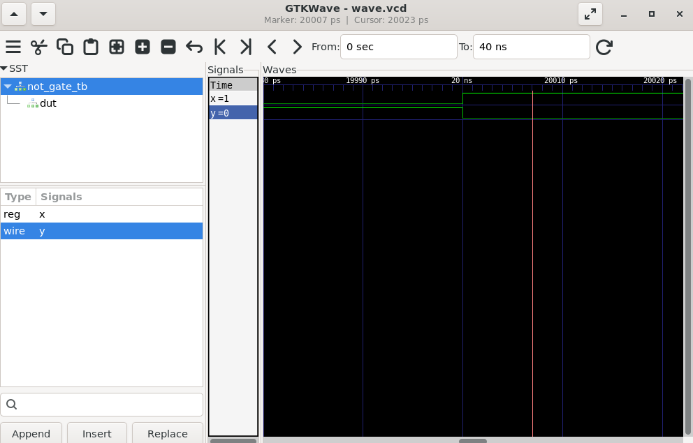

# 03 - NOT Gate

## 📌 Objective

Design and simulate a 1-input NOT gate (Inverter) using Verilog HDL.

---

## 📖 Theory

A NOT gate, also known as an **Inverter**, produces the complement of the input.

### Boolean Equation

```
Y = ~A
```

---

## 🔢 Truth Table

| A | Y |
|---|---|
| 0 | 1 |
| 1 | 0 |

---

## 🛠️ Tools Used

- Verilog HDL
- Icarus Verilog
- GTKWave
- VS Code
- Ubuntu (WSL)

---

## 📂 Project Files

```
02_NOT_Gate
│── not_gate.v
│── not_gate_tb.v
│── waveform.png
└── README.md
```

---

## ▶️ Compilation

```bash
iverilog -o not.out not_gate.v not_gate_tb.v
```

---

## ▶️ Simulation

```bash
vvp not.out
```

---

## 📈 Waveform

```bash
gtkwave wave.vcd
```

Add the waveform screenshot below after uploading `waveform.png`.



---

## 💻 RTL Code

### not_gate.v

```verilog
module not_gate(a,b);

    input a;
    output b;

    assign b = ~a;

endmodule
```

---

### not_gate_tb.v

```verilog
`timescale 1ns/1ps

module not_gate_tb;

reg x;
wire y;

not_gate dut(
    .a(x),
    .b(y)
);

initial begin
    $dumpfile("wave.vcd");
    $dumpvars(0, not_gate_tb);

    x = 0;
    #10;

    x = 1;
    #10;

    $finish;
end

initial begin
    $monitor($time, " x=%b y=%b", x, y);
end

endmodule
```

---

## 📊 Expected Simulation Output

```
0   x=0 y=1
10  x=1 y=0
```

---

## 📚 Learning Outcome

- Understanding an inverter (NOT gate)
- Using the Verilog NOT operator (`~`)
- Writing a Verilog testbench
- Generating simulation waveforms
- Verifying digital logic using Icarus Verilog and GTKWave

---

**Author:** Abhishek A Nair
