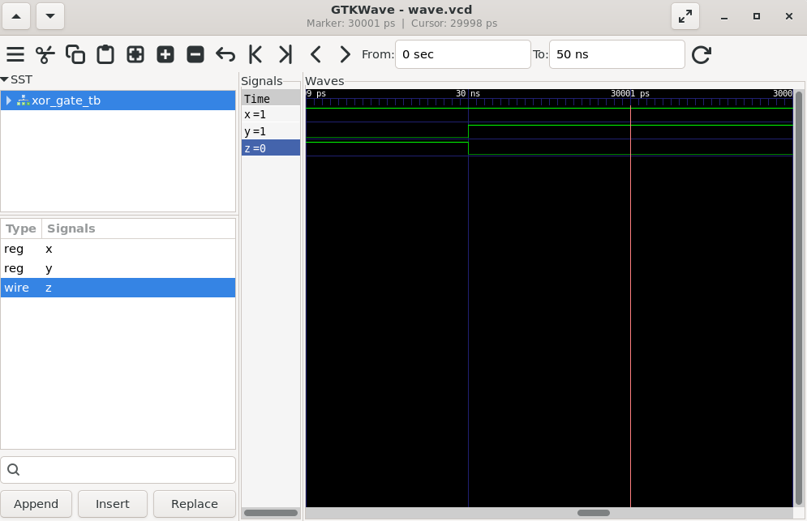

# 04 - XOR Gate

## 📌 Objective

Design and simulate a 2-input XOR (Exclusive OR) gate using Verilog HDL.

---

## 📖 Theory

An XOR gate produces a HIGH (1) output only when the two inputs are **different**.

### Boolean Equation

```
Y = A ^ B
```

---

## 🔢 Truth Table

| A | B | Y |
|---|---|---|
| 0 | 0 | 0 |
| 0 | 1 | 1 |
| 1 | 0 | 1 |
| 1 | 1 | 0 |

---

## 🧠 Key Concept

Unlike an OR gate, an XOR gate outputs **1 only when the inputs are different**.

### OR Gate

```
0 OR 0 = 0
0 OR 1 = 1
1 OR 0 = 1
1 OR 1 = 1
```

### XOR Gate

```
0 XOR 0 = 0
0 XOR 1 = 1
1 XOR 0 = 1
1 XOR 1 = 0
```

---

## 🛠️ Tools Used

- Verilog HDL
- Icarus Verilog
- GTKWave
- VS Code
- Ubuntu (WSL)

---

## 📂 Project Files

```
04_XOR_Gate
│── xor_gate.v
│── xor_gate_tb.v
│── waveform.png
└── README.md
```

---

## ▶️ Compilation

```bash
iverilog -o xor.out xor_gate.v xor_gate_tb.v
```

---

## ▶️ Simulation

```bash
vvp xor.out
```

---

## 📈 Waveform

```bash
gtkwave wave.vcd
```

Add your GTKWave waveform screenshot below.



---

## 💻 RTL Code

### xor_gate.v

```verilog
module xor_gate(a,b,c);

    input a,b;
    output c;

    assign c = a ^ b;

endmodule
```

---

### xor_gate_tb.v

```verilog
`timescale 1ns/1ps

module xor_gate_tb;

reg x,y;
wire z;

xor_gate dut(.a(x), .b(y), .c(z));

initial begin

    $dumpfile("wave.vcd");
    $dumpvars(0,xor_gate_tb);

    x = 0; y = 0;
    #10 x = 0; y = 1;
    #10 x = 1; y = 0;
    #10 x = 1; y = 1;

    #20 $finish;

end

initial begin
    $monitor($time," x=%b y=%b z=%b",x,y,z);
end

endmodule
```

---

## 📊 Expected Simulation Output

```
0   x=0 y=0 z=0
10  x=0 y=1 z=1
20  x=1 y=0 z=1
30  x=1 y=1 z=0
```

---

## 🎯 Applications

- Half Adder
- Full Adder
- Parity Generator
- Error Detection
- Comparator
- Cryptographic Circuits

---

## 📚 Learning Outcome

- Understanding XOR logic
- Using the XOR (`^`) operator in Verilog
- Writing and verifying a testbench
- Viewing simulation waveforms using GTKWave
- Understanding the difference between OR and XOR gates

---

**Author:** Abhishek A Nair
