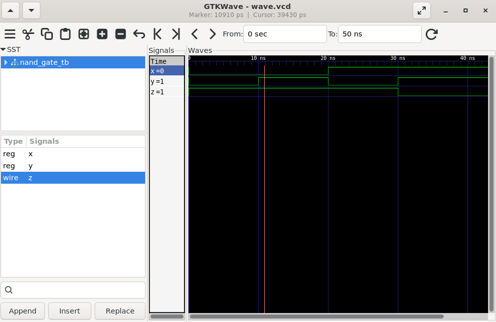

# 05 - NAND Gate

## 📌 Objective

Design and simulate a 2-input NAND gate using Verilog HDL.

---

## 📖 Theory

A NAND gate is the complement of an AND gate. It produces a LOW (0) output only when **both inputs are HIGH (1)**.

### Boolean Equation

```
Y = ~(A & B)
```

or equivalently in Verilog,

```verilog
assign Y = A ~& B;
```

---

## 🔢 Truth Table

| A | B | Y |
|---|---|---|
| 0 | 0 | 1 |
| 0 | 1 | 1 |
| 1 | 0 | 1 |
| 1 | 1 | 0 |

---

## 🧠 Key Concept

A **NAND gate is a Universal Gate**.

This means every basic logic gate (NOT, AND, OR, XOR, NOR, etc.) and any digital circuit can be implemented using only NAND gates.

---

## 🛠️ Tools Used

- Verilog HDL
- Icarus Verilog
- GTKWave
- VS Code
- Ubuntu (WSL)

---

## 📂 Project Files

```
05_NAND_Gate
│── nand_gate.v
│── nand_gate_tb.v
│── waveform.png
└── README.md
```

---

## ▶️ Compilation

```bash
iverilog -o nand.out nand_gate.v nand_gate_tb.v
```

---

## ▶️ Simulation

```bash
vvp nand.out
```

---

## 📈 Waveform

```bash
gtkwave wave.vcd
```

After simulation, add your waveform screenshot below.



---

## 💻 RTL Code

### nand_gate.v

```verilog
module nand_gate(a,b,c);

input a,b;
output c;

assign c = a ~& b;

endmodule
```

---

### nand_gate_tb.v

```verilog
`timescale 1ns/1ps

module nand_gate_tb;

reg x,y;
wire z;

nand_gate dut(.a(x), .b(y), .c(z));

initial begin

    $dumpfile("wave.vcd");
    $dumpvars(0,nand_gate_tb);

    x = 0; y = 0;
    #10 x = 0; y = 1;
    #10 x = 1; y = 0;
    #10 x = 1; y = 1;

    #20 $finish;

end

initial begin
    $monitor($time," x=%b y=%b z=%b",x,y,z);
end

endmodule
```

---

## 📊 Expected Simulation Output

```
0   x=0 y=0 z=1
10  x=0 y=1 z=1
20  x=1 y=0 z=1
30  x=1 y=1 z=0
```

---

## 🎯 Applications

- Universal Gate Implementation
- Arithmetic Logic Units (ALUs)
- Memory Circuits
- Sequential Logic
- Digital Processors
- Control Logic

---

## 📚 Learning Outcome

- Understanding NAND gate operation
- Learning the Verilog NAND operator (`~&`)
- Writing and verifying RTL using Verilog
- Simulating digital circuits using Icarus Verilog
- Visualizing waveforms using GTKWave
- Understanding why NAND is called a Universal Gate

---

## 👨‍💻 Author

**Abhishek A Nair**
